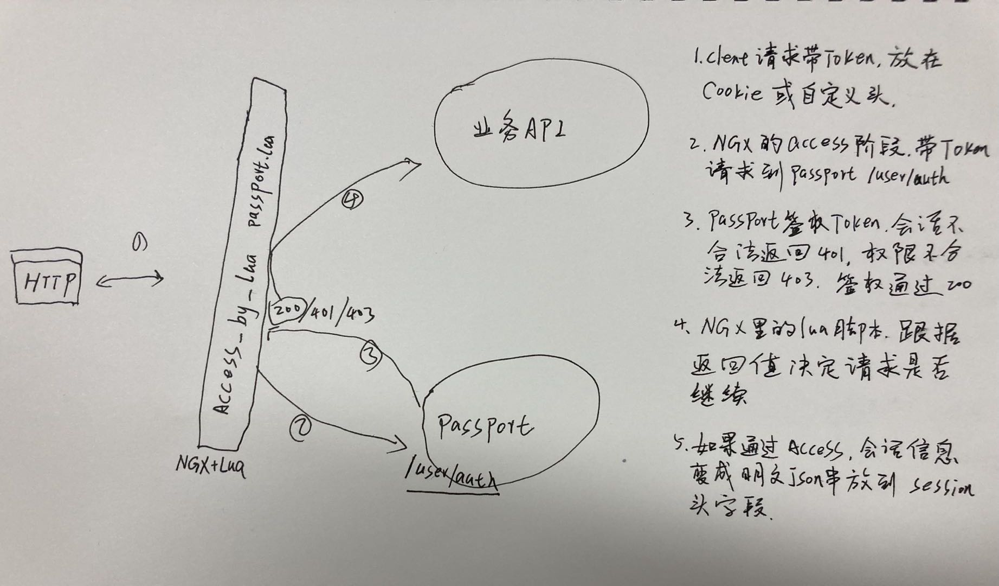

[toc]

## 用户中心(Passport)

用户基础信息维护、登录、权限验证、会话管理。


## 开始使用
### 作为一个单独的服务

可以启动为一个独立的用户中心服务，提供HTTP服务。passport会接管API的签权逻辑。业务逻辑不必关心会话权限。




#### 配置

```yaml
pid_file: "/tmp/passport.pid"
face: "http"
addr: ":8080"
log_dir: "./logs"
log_level: "debug"

pg_urn: "host=localhost user=passport password=passport123 dbname=passport port=5432 sslmode=disable TimeZone=Asia/Shanghai"
redis: ""

session_store_type: "mem" # cookie
session_expire: 0 # -1: 删除；0: 本会话; >0...

# 管理接口只有指定的租户可用
root_tenant_id: 10002

# sms配置
# sms供应商名，为空不启用sms相关功能。可选：tencentcloud / ...
sms: ""
sms_conf:
  secret_id: "xxx"
  secret_key: "xxx"
  sdk_app_id: "xxx"
  sign_name: "xxx"
  user_add_template_id: "xxx"

wx_mini_app:
  appid: "xxx"
  secret: "xxx"

api_conf:
  "api1":
    need_access: false
  "*": # 默认值
    need_access: true
```


### 作为代码模块整合到HTTP路由

只需要像下面代码一样添加一个路由

```go
package main

import (
	"net/http"
	"time"

	passport "github.com/liuhengloveyou/passport/face"
	passportprotos "github.com/liuhengloveyou/passport/protos"
)

func main() {
	if err := InitHttpApi(":8080"); err != nil {
		panic(err.Error())
	}
}

func InitHttpApi(addr string) error {
	options := &passportprotos.OptionStruct{
		LogDir:    "./logs", // 日志目录
		LogLevel:  "debug",  // 日志级别
		PgURN:  "host=localhost user=passport password=passport123 dbname=passport port=5432 sslmode=disable TimeZone=Asia/Shanghai",
	}
	http.Handle("/usercenter", passport.InitAndRunHttpApi(options))
	// 业务可以挂在这里
	http.Handle("/", &HttpServer{})

	s := &http.Server{
		Addr:           addr,
		ReadTimeout:    10 * time.Minute,
		WriteTimeout:   10 * time.Minute,
		MaxHeaderBytes: 1 << 20,
	}

	if err := s.ListenAndServe(); err != nil {
		return err
	}

	return nil
}

type HttpServer struct{}

func (p *HttpServer) ServeHTTP(w http.ResponseWriter, r *http.Request) {
	w.Write([]byte("hello passport"))
}
```


### 作为代码模块整合到gin路由

如果用gin框架，像下面一样添加路由
```go
package main

import (
	"github.com/gin-gonic/gin"
	passport "github.com/liuhengloveyou/passport/face"
	passportprotos "github.com/liuhengloveyou/passport/protos"
)

var engine *gin.Engine

func main() {
	if err := InitAdnRun(":8080"); err != nil {
		panic(err.Error())
	}
}

func InitAdnRun(addr string) error {
	engine = gin.Default()

	engine.GET("/ping", func(c *gin.Context) {
		c.String(200, "pong")
	})

	options := &passportprotos.OptionStruct{
		LogDir:    "./logs", // 日志目录
		LogLevel:  "debug",  // 日志级别
		PgURN:  "host=localhost user=passport password=passport123 dbname=passport port=5432 sslmode=disable TimeZone=Asia/Shanghai",
	}
	engine.Any("/user", gin.WrapH(passport.InitAndRunHttpApi(options)))

	if err := engine.Run(addr); err != nil {
		return err
	}

	return nil
}
```


## 共用字段定义

### 账号相关

| 参数字段  | 解释     | 取值范围            |
| --------- | -------- | ------------------- |
| uid  | 用户账号ID | >0的正整数   |
| password  | 密码     | 6~64位字符串        |
| cellphone | 手机号   |  11位中国手机号码    |
| email     | 邮箱地址 |  email格式；最长64位 |
| nickname  | 昵称     |  2~32位字符串        |
| gender    | 性别     | 1 = 男，2 = 女         |
| addr      | 地址     | 1~100个字符            |

### 角色相关

角色名最长 <=100个字符。角色值最长 <=100个字符。权限主题串最长 <=100个字符。权限动作串最长 <=10个字符。

### 租户相关

| 参数字段    | 解释     | 取值范围      |
| ----------- | -------- | ------------- |
| tenant_id   | 租户ID   | >0的正整数    |
| tenant_name | 租户名   | 2~100位字符串 |
| tenant_type | 租户类型 | 2~10位字符串  |


## 接口

GET请求使用标准的URL参数，POST用JSON格式的body。

### 注册/添加用户

cellphone、email、nickname三个字段必须有一个且只有一个

| 参数字段  | 是否必须 |
| --------- | -------- |
| password  | 是       |
| cellphone |  否       |
| email     |  否       |
| nickname  |  否       |
| sms  |  启用验证码的话，必填。否者不用填        |


示例：

```shell
curl -v -H "X-API: user/register" -d \
'{
	"cellphone": "15360651247",
	"password": "123456"
}' "http://127.0.0.1:10000/usercenter"

{
	"code":0,
	"data":10000
}
```

### 登入

cellphone、email、nickname三个字段必须有一个且只有一个

| 参数字段  | 是否必须 |
| --------- | -------- |
| password  | 是       |
| cellphone |  否       |
| email     |  否       |
| nickname  |  否       |

```bash
curl -v -X POST -H "X-API: user/login" -H "USE-COOKIE: true" -d \
'{
    "cellphone": "15360651247",
    "password": "123456"
}' "http://127.0.0.1:10000/usercenter"

{
	"code":0,
	"data":{
    "uid":10000,
    "tenant_id":10049,
    "cellphone":"17688396389",
    "nickname":"17688396389",
    "LoginTime":"2021-05-12T10:48:43.132678+08:00",
    "ext":{
      "TOKEN":"MTYyMDc4Nz"
    },
    "tenant":{
      "id":10049,
      "uid":10000,
      "tenant_name":"tenant6",
      "tenant_type":"t1"
    }
	}
}
```

> USE-COOKIE默认为true；此时，返回token头，body没有ext字段。

### 登出

```bash
curl -i -X GET -H "X-API: user/logout" --cookie "go-session-id=MTY" \
"http://127.0.0.1:10000/usercenter"

{
	code: 0,
  data: "OK"
}
```

### 签权

```bash
curl -i -X GET -H "X-API: user/auth" -H "X-Requested-By: api1" --cookie "go-session=MTc1MDc2xxx" \
"http://127.0.0.1:10000/usercenter"

{
	code: 0,
  data: {
    "cellphone":"18510511015", 
    "email":"liuhengloveyou@gmail.com",
    "nickname":"恒"
	}
}
```

> X-Requested-By：业务服务API

### 更新自己账号信息

| 参数      |  是否必须 | 取值 |
| --------- |  -------- | --------- |
| cellphone | 否       | 中国的11位手机号 |
| email     | 否       | 电子邮箱地址 |
| nickname  | 否       |  |
| addr      |  否       |  |
| gender    |  否       | 1 = 男，2 = 女 |

```bash
curl -v -X POST -H "X-API: user/modify" --cookie "go-session-id=MTYxNDE0N" -d \
'{
	"email":"liuhengloveyou@gmail.com"
}' "http://127.0.0.1:10000/usercenter"

{
	"code":0,
	"data":"OK"
}
```

### 更新密码

密码为6~64位字符串

| 参数 | 解释   | 是否必须 |
| ---- | ------ | -------- |
| n    | 新密码 | 是       |
| o    | 旧密码 | 是       |


示例：
```bash
curl -v -X POST -H "X-API: user/modify/password" --cookie "go-session-id=MTYxNDE0N" -d \
'{
	"n":"new pwd", 
	"o":"old pwd",
}' "http://127.0.0.1:10000/usercenter"

{
	"code":0,
	"data":"OK"
}
```

### 用短信更新密码


| 参数 | 解释   | 是否必须 |
| ---- | ------ | -------- |
| cellphone    | 手机号码 | 是       |
| sms    | 短信验证码 | 是       |
| n    | 6~64位字符串新密码 | 是       |


示例：
```bash
curl -v -X POST -H "X-API: user/modify/getbackpwd" -d \
'{
  "cellphone":"17612116527", 
  "sms":"xxxxxx", 
  "n":"new pwd",
}' "http://127.0.0.1:10000/usercenter"

{
	"code":0,
	"data":"OK"
}
```

### 更新头像

```
POST /usercenter
Header: {
    cookie: gsessionid=xxxxxx
}
Body: {
}
```

### 查询自己的账号详情

```bash
curl -v -X GET -H "X-API: user/info" --cookie "go-session-id=MTYxNDE0N" "http://127.0.0.1:10000/usercenter"

{
    code: 0,
    "data": {
        "uid":10000,
        "cellphone":"17688396387",
        "nickname":"17688396387",
    }
}
```

### 用UID查询账号详情

```
curl -v -X GET -H "X-API: user/infoByUID" --cookie "go-session-id=MTYxNDE0N" "http://127.0.0.1:10000/usercenter?uid=10000"

成功返回:
{
    code: 0,
    "data": {
        "uid":10000,
        "cellphone":"17688396387",
        "nickname":"17688396387",
    }
}
```


## 访问控制(支持域/租户的RBAC)相关接口

可以用RBAC模型做功能和数据的访问权限控制。

### 为用户添加角色

| 参数名 | 解释                   | 是否必须 |
| ------ | ---------------------- | -------- |
| uid    | 用户ID                 | 是       |
| value  | 角色值；<100个字符的串 | 是       |

```shell
curl -v -X POST -H "X-API: access/addRoleForUser" --cookie "go-session-id=MTYxO“ -d \
'{
  "uid": 123,
  "value": "role1"
}' "http://127.0.0.1:10000/usercenter"
```

### 从用户删除角色

| 参数名 | 解释                   | 是否必须 |
| ------ | ---------------------- | -------- |
| uid    | 用户ID                 | 是       |
| value  | 角色值；<100个字符的串 | 是       |

```shell
curl -v -X POST -H "X-API: access/removeRoleForUser" --cookie "go-session-id=MTYxO“ -d \
'{
   "uid": 123,
   "value": "role1"
}' "http://127.0.0.1:10000/usercenter"
```


### 查询拥有一个角色的用户列表
```shell
curl -v -X GET -H "X-API: access/getUsersForRole" --cookie "go-session-id=MTYxO“ "http://127.0.0.1:10000/usercenter?role=role1"
```

### 查询一个用户拥有的角色列表
```shell
curl -v -X GET -H "X-API: access/getRolesForUser" --cookie "go-session-id=MTYxO“ "http://127.0.0.1:10000/usercenter?uid=123"
```

### 为角色添加权限

```shell
curl -v -X POST -H "X-API: access/addPolicyToRole" --cookie "go-session-id=MTYxO” -d \
'{
  "role": "role1",
  "obj": "data1",
  "act": "read"
}' "http://127.0.0.1:10000/usercenter"
```

### 从角色删除权限

```shell
curl -v -X POST -H "X-API: access/removePolicyFromRole" -d \
'{
  "uid": 123,
  "sub": "data1",
  "act": "read"
}' "http://127.0.0.1:10000/usercenter"
```

### 查询策略列表
默认查询全部，可以用角色过滤
```shell
curl -v -X GET -H "X-API: access/getPolicy" --cookie "go-session-id=MTY" "http://127.0.0.1:10000/usercenter?roles=role1,role2,role3"

{
	"code":0,
	"data":[
		["role1","tenant-10049","data1","read"],
		["role1","tenant-10049","data2","read"]
	]
}
```


### 查询当前用户策略列表

```shell
curl -v -X GET -H "X-API: access/getPolicyForUser" --cookie "go-session-id=MTY" "http://127.0.0.1:10000/usercenter"

{
	"code":0,
	"data":[
		["role1","tenant-10049","data1","read"],
		["role1","tenant-10049","data2","read"]
	]
}
```

### 添加权限字典条目

```bash
curl -X POST -H "X-API: access/addPermission" --cookie "go-session-id=MTY" -d \
'{
	"domain": "demo.passport.com",
  "title": "api-a",
  "value": "/a/b/c"
}' "http://127.0.0.1:10000/usercenter"
```

### 删除权限字典条目

```bash
curl -X GET -H "X-API: access/delPermission" --cookie "go-session-id=MTY" \
"http://127.0.0.1:10000/usercenter?id=xxx"
```


### 查询权限字典列表

```bash
curl -X GET -H "X-API: access/listPermission" --cookie "go-session-id=MTY" \
"http://127.0.0.1:10000/usercenter?domain=xxx"
```


## 多租户相关接口

每个用户只能属于一个租户

### 添加租户和超级管理员

只有root租户的超级管理员登录，才能通过该接口添加租户和管理员

| 参数字段    | 解释     | 必填 |
| ----------- | -------- | ---- |
| tenant_name | 租户名   | 是   |
| tenant_type | 租户类型 | 是   |
| cellphone | 该租户管理员手机号 |是|
| password  | 该租户管理员密码 |是|


```shell
curl -v -X POST -H "X-API: tenant/new" --cookie "go-session-id=V6VbtYfgFKSlOYwQ==" -d \
'{
  "tenantName": "tenant1",
  "tenantType": "t1",
  "cellphone": "18888888888", 
  "password": "123456",

}' "http://127.0.0.1:10000/usercenter"
```


### 租户列表

只有root租户的超级管理员登录，才能通过该接口查询租户列表

| 参数字段    | 解释     | 必填 |
| ----------- | -------- | ---- |
| tenant_name | 租户名   | 是   |
| tenant_type | 租户类型 | 是   |
| cellphone | 该租户管理员手机号 |是|
| password  | 该租户管理员密码 |是|


```shell
curl -v -X POST -H "X-API: tenant/new" --cookie "go-session-id=V6VbtYfgFKSlOYwQ==" -d \
'{
  "tenantName": "tenant1",
  "tenantType": "t1",
  "cellphone": "18888888888", 
  "password": "123456",

}' "http://127.0.0.1:10000/usercenter"
```


### 添加租户

登录用户添加租户，将成为该租户的管理员

| 参数字段      | 解释     | 必填 |
| ------------- | -------- | ---- |
| tenant_name   | 租户名   | 是   |
| tenant_type   | 租户类型 | 是   |
| configuration | 租户配置 | 否   |

```shell
curl -v -X POST -H "X-API: tenant/add" --cookie "go-session-id=V6VbtYfgFKSlOYwQ==" -d \
'{
  "tenantName": "tenant1",
  "tenantType": "t1",
  "configuration": {
  	"more": {
  		"k": "conf-aaa",
      "v": {
           "aaa": "aaaaaaaaaaaaaaa"
      }
  	}
  }
}' "http://127.0.0.1:10000/usercenter"
```


### 更新租户配置信息

配置的value，可以是任何结构。passport不作限制，由业务系统判断格式。

key最长64个字符，请求体最长1024个字符，每次最多100个key。

```shell
curl -v -X POST -H "X-API: tenant/updateConfiguration" --cookie "go-session-id=VbtYfgFKSlOYwQ==" -d \
'{
  "conf-key": {
       "aaa": "aaaaaaaaaaaaaaa"
  },
  "conf-bbb": null,
}' "http://127.0.0.1:10000/usercenter"
```

### 查询当前租户配置信息

```shell
curl -v -X GET -H "X-API: tenant/loadConfiguration" --cookie "go-session-id=gFKSlOYwQ==" "http://127.0.0.1:10000/usercenter?k=key"
```

### 成员(账号)

#### 租户管理员添加账号

| 参数字段 | 解释                                          | 取值                |
| -------- | --------------------------------------------- | ------------------- |
| disable  | 是否停用；默认为0，不停用。                   | [1 \|0]             |
| role     | 角色字典里的value数组，最长10。               | 字符串数组          |
| uid      | 用户id；如果=0，新建账号见`user/register`接口 | 系统已有账号id 或 0 |
| depIds   | 部门ID                                        | int数组             |

```shell
curl -v -X POST -H "X-API: tenant/user/add" --cookie "go-session-id=MTYfgFKSlOYwQ==" -d \
'{
  "uid": 123,
  "nickname": "xxx",
  "password": "123456",
  "role": ["r1", "r2"],
  "depIds": [1, 2],
  "disable": 1
}' "http://127.0.0.1:10000/usercenter"

{
	"code":0,
	"data":10000 // 账号ID
}
```


#### 租户管理员删除账号
```shell
curl -v -X POST -H "X-API: tenant/delUser" --cookie "go-session-id=MTYfgFKSlOYwQ==" -d \
'{
  "uid": 123,
}' "http://127.0.0.1:10000/usercenter"
```


#### 查询当前租户账号列表

可选参数nickname和uids互斥:

| 参数字段 | 解释                 |
| -------- | -------------------- |
| nickname | 用账号昵称模糊查询   |
| uids     | 账号id列表，逗号分隔 |

```shell
curl -v -X GET -H "X-API: tenant/getUsers" --cookie "go-session-id=MTYfgFKSlOYwQ==" \
"http://127.0.0.1:10000/usercenter?nickname=xxx&uids=1,2,3&page=1&pageSize=1"
```


#### 租户管理员修改账号密码
```shell
curl -v -X POST -H "X-API: tenant/modifyUserPassword" --cookie "go-session-id=VbtYfgFKSlOYwQ==" -d \
'{
	"uid": 123,
  "pwd": "pwd"
}' "http://127.0.0.1:10000/usercenter"
```

#### 租户管理员停用/启用账号

| 参数字段 | 解释           | 必填 |
| -------- | -------------- | ---- |
| uid      | 账号ID         | 是   |
| disable  | 停用=1；启用=0 | 是   |

```shell
curl -v -X POST -H "X-API: tenant/userDisableByUID" --cookie "go-session-id=MTOYwQ==" -d \
'{
  "uid": 123,
  "disable": 1
}' "http://127.0.0.1:10000/usercenter"
```

#### 租户管理员更新成员账号扩展信息

| 参数字段 | 解释           | 必填 |
| -------- | -------------- | ---- |
| uid      | 账号ID         | 是   |
| k        | 最长10个字的串 | 是   |
| v        | 任意类型       | 否   |

```shell
curl -v -X POST -H "X-API: tenant/userModifyExtInfo" --cookie "go-session-id=MTOYwQ==" -d \
'{
  "uid": 123,
  "k": "key",
  "v": "xxx"
}' "http://127.0.0.1:10000/usercenter"
```

#### 设置成员的部门信息

```shell
curl -i -X POST -H "X-API: tenant/user/setDepartment" --cookie "go-session-id=xxx" \
-d '{
	"uid": 123,
	"depIds": [1,2]
}' "http://127.0.0.1:10000/usercenter"
```

### 角色

#### 添加角色字典

管理员向当前租户添加角色字典

```shell
curl -v -X POST -H "X-API: tenant/addRole" --cookie "go-session-id=VbtYfgFKSlOYwQ==" -d \
'{
  "title": "角色1",
  "value": "role1"
}' "http://127.0.0.1:10000/usercenter"
```

#### 删除角色字典

管理员删除当前租户角色字典

```shell
curl -v -X POST -H "X-API: tenant/delRole" --cookie "go-session-id=VbtYfgFKSlOYwQ==" -d \
'{
  "value": "role1"
}' "http://127.0.0.1:10000/usercenter"
```

#### 查询当前租户的角色字典
```shell
curl -v -X GET -H "X-API: tenant/getRoles" --cookie "go-session-id=MTYfgFKSlOYwQ==" \
"http://127.0.0.1:10000/usercenter"
```


### 部门

#### 添加部门记录

```shell
curl -v -X POST -H "X-API: tenant/department/add" --cookie "go-session-id=gFKSlOYwQ==" -d \
'{
  "parentId": 0,
  "name": "dep1"
}' "http://127.0.0.1:10000/usercenter"
```

#### 删除部门记录

```shell
curl -v -X GET -H "X-API: tenant/department/delete" --cookie "go-session-id=gFKSlOYwQ==" "http://127.0.0.1:10000/usercenter?id=123"
```

#### 更新部门名

```shell
curl -v -X POST -H "X-API: tenant/department/update" --cookie "go-session-id=gFKSlOYwQ==" -d \
'{
  "id": 123,
  "name": "dep1"
}' "http://127.0.0.1:10000/usercenter"
```

#### 查询部门列表

```shell
curl -v -X GET -H "X-API: tenant/department/list" --cookie "go-session-id=gFKSlOYwQ==" "http://127.0.0.1:10000/usercenter?id=123"
```


## 短信接口

### 发送用户注册验证码 

```shell
curl -v -X POST -H "X-API: sms/sendUserAddSmsCode" -d \
'{
  "cellphone": "17612116527",
  "aliveSec": 5
}' "http://127.0.0.1:10000/usercenter"
```

### 发送找回密码验证码 

```shell
curl -v -X POST -H "X-API: sms/sendGetBackPwdSms" -d \
'{
  "cellphone": "17612116527",
  "aliveSec": 60
}' "http://127.0.0.1:10000/usercenter"
```

### 发送用户登录验证码 

```shell
curl -v -X POST -H "X-API: sms/sendUserLoginSms" -d \
'{
  "cellphone": "17612116527",
  "aliveSec": 60
}' "http://127.0.0.1:10000/usercenter"
```


## SAAS系统管理接口

管理接口只有指定的租户(saas系统总管理后台)可用

### 查询租户列表

```bash
curl -v -H "X-API: admin/tenantList" --cookie "go-session-id=VbtYfgFKSlOYwQ==" \
"http://127.0.0.1:10000/usercenter?page=1&pageSize=1&hasTotal=1"
```

### 更新租户配置信息

同 [更新租户配置信息](更新租户配置信息)

```shell
curl -v -X POST -H "X-API: admin/updateTenantConfiguration" --cookie "go-session-id=VbtYfgFKSlOYwQ==" -d \
'{
	"tenant_id": 123,
	"data": {
    "k-a": "角aaa",
    "v-b": {
         "aaa": "aaaaaaaaaaaaaaa"
    }
	}
}' "http://127.0.0.1:10000/usercenter"
```

### 更新用户密码

```shell
curl -v -X POST -H "X-API: admin/modifyUserPassword" --cookie "go-session-id=VbtYfgFKSlOYwQ==" -d \
'{
	"uid": 123,
  "pwd": "pwd"
}' "http://127.0.0.1:10000/usercenter"
```


## 应答格式说明

应答格式为JSON。正确情况：

```json
{
  "code": 0,
  "data":xxx
}
```

出错误情况：

```json
{
  "code": -1,
  "msg": "错误信息"
}
```


## 错误信息说明

```json
ErrOK        = errors.Error{Code: 0, Message: "OK"}
ErrNull      = errors.Error{Code: 1, Message: "结果为空"}
ErrParam     = errors.NewError(-1000, "请求参数错误")
ErrService   = errors.NewError(-1001, "服务错误")
ErrSession   = errors.NewError(-1002, "会话错误")
ErrNoLogin   = errors.NewError(-1003, "请登录")
ErrNoAuth    = errors.NewError(-1004, "没有权限")
ErrPgDupKey  = errors.NewError(-1005, "重复记录")
ErrLogin     = errors.NewError(-1006, "登录失败")
ErrPWD       = errors.NewError(-1007, "密码不正确")
ErrDisable   = errors.NewError(-1008, "账号已停用")
ErrUserNmae  = errors.NewError(-1009, "账号为空")
ErrPWDNil    = errors.NewError(-1010, "密码为空")
ErrPhoneDup  = errors.NewError(-1011, "手机号码重复")
ErrEmailDup  = errors.NewError(-1012, "邮箱重复")
ErrNickDup   = errors.NewError(-1013, "昵称重复")
ErrModify    = errors.NewError(-1014, "更新用户信息失败") //

ErrTenantNotFound = errors.NewError(-2000, "租户不存在")
ErrTenantNameNull = errors.NewError(-2001, "租户名字为空")
ErrTenantTypeNull = errors.NewError(-2002, "租户类型为空")
ErrTenantLimit    = errors.NewError(-2003, "账号只能属于一个租户")
ErrTenantAddERR   = errors.NewError(-2004, "添加租户失败")
```


## 数据库表结构

使用postgresql数据库。可以创建单独的数据库， 也可以在业务库里添加users表， 表结构至少包含如下字段：

```sql
psql postgres  # 以当前用户登录默认数据库

-- Create new database
CREATE USER passport WITH PASSWORD 'passport123';
CREATE DATABASE passport OWNER passport;
\q  # 退出

psql -U passport -d passport -h 127.0.0.1 -p 5432
\l              -- List all databases
\c passport     -- Connect to a database
\dt             -- List tables in current database
\q              -- Quit psql

-- 用户表
-- DROP TABLE IF EXISTS public.users;
CREATE TABLE users1
(
  uid BIGSERIAL PRIMARY KEY,
  tenant_id BIGINT NOT NULL DEFAULT 0,
  nickname VARCHAR(64) UNIQUE,
  cellphone VARCHAR(11) UNIQUE,
  email VARCHAR(255) UNIQUE,
  wx_openid VARCHAR(64) UNIQUE,
  password VARCHAR(512) NOT NULL,
  avatar_url VARCHAR(255),
  gender SMALLINT,
  addr VARCHAR(1024),
  province VARCHAR(64),
  city VARCHAR(64),
  ext JSONB,
  create_time TIMESTAMPTZ NOT NULL DEFAULT CURRENT_TIMESTAMP,
  update_time TIMESTAMPTZ NOT NULL DEFAULT CURRENT_TIMESTAMP,
  login_time TIMESTAMPTZ
);
-- ALTER TABLE IF EXISTS public.users OWNER to pcdn;
-- DROP INDEX IF EXISTS public.tenant_id;
CREATE INDEX IF NOT EXISTS idx_users_tenant_id ON users(tenant_id) WITH (deduplicate_items=True);
ALTER SEQUENCE users_uid_seq RESTART WITH 10000;

-- 租户表
CREATE TABLE tenants (
  id BIGSERIAL PRIMARY KEY,
  uid BIGINT NOT NULL DEFAULT 0,
  tenant_name VARCHAR(255) NOT NULL UNIQUE,
  tenant_type VARCHAR(45) NOT NULL DEFAULT '',
  info JSONB,
  configuration JSONB,
  create_time TIMESTAMPTZ NOT NULL DEFAULT CURRENT_TIMESTAMP,
  update_time TIMESTAMPTZ NOT NULL DEFAULT CURRENT_TIMESTAMP
);
-- To set the starting value for the auto-incrementing ID:
ALTER SEQUENCE tenants_id_seq RESTART WITH 10000;
CREATE INDEX IF NOT EXISTS idx_tenants_parent_id ON tenants(parent_id);
CREATE INDEX IF NOT EXISTS idx_tenants_tenant_name ON tenants(tenant_name);

-- 权限表
CREATE TABLE permission (
  id BIGSERIAL PRIMARY KEY,
  tenant_id INT NOT NULL,
  domain VARCHAR(128) NOT NULL,
  title VARCHAR(128) NOT NULL,
  value VARCHAR(256) NOT NULL,
  create_time TIMESTAMPTZ NOT NULL DEFAULT CURRENT_TIMESTAMP,
  update_time TIMESTAMPTZ NOT NULL DEFAULT CURRENT_TIMESTAMP,
  UNIQUE (tenant_id, domain, title),
  UNIQUE (value, domain, tenant_id)
);
-- To set the starting value for the auto-incrementing ID:
ALTER SEQUENCE permission_id_seq RESTART WITH 10000;
CREATE INDEX IF NOT EXISTS idx_permission_tenant_id ON permission(tenant_id);
CREATE INDEX IF NOT EXISTS idx_permission_domain ON permission(domain);

-- 部门表
CREATE TABLE departments (
  id SERIAL PRIMARY KEY,
  uid INT NOT NULL,
  tenant_id INT NOT NULL,
  parent_id BIGINT NOT NULL DEFAULT 0,
  create_time TIMESTAMPTZ NOT NULL DEFAULT CURRENT_TIMESTAMP,
  update_time TIMESTAMPTZ NOT NULL DEFAULT CURRENT_TIMESTAMP,
  name VARCHAR(16) NOT NULL,
  config JSONB,
  UNIQUE (tenant_id, name)
);
-- To set the starting value for the auto-incrementing ID:
ALTER SEQUENCE departments_id_seq RESTART WITH 10000;
CREATE INDEX IF NOT EXISTS idx_departments_tenant_id ON departments(tenant_id);
CREATE INDEX IF NOT EXISTS idx_departments_parent_id ON departments(parent_id);
CREATE INDEX IF NOT EXISTS idx_departments_uid ON departments(uid);

-- 用户闭包表
CREATE TABLE IF NOT EXISTS user_closure (
	ancestor_id BIGINT NOT NULL REFERENCES users(uid) ON DELETE CASCADE,
	descendant_id BIGINT NOT NULL REFERENCES users(uid) ON DELETE CASCADE,
	depth INT NOT NULL CHECK (depth >= 0),
	PRIMARY KEY (ancestor_id, descendant_id)
);
CREATE INDEX IF NOT EXISTS idx_user_closure_ancestor ON user_closure(ancestor_id);
CREATE INDEX IF NOT EXISTS idx_user_closure_descendant ON user_closure(descendant_id);

-- 租户闭包表
CREATE TABLE IF NOT EXISTS tenant_closure (
  ancestor_id BIGINT NOT NULL REFERENCES tenants(id) ON DELETE CASCADE,
	descendant_id BIGINT NOT NULL REFERENCES tenants(id) ON DELETE CASCADE,
	depth INT NOT NULL CHECK (depth >= 0),
	PRIMARY KEY (ancestor_id, descendant_id)
);
CREATE INDEX IF NOT EXISTS idx_tenant_closure_tenant_id ON tenant_closure(ancestor_id);
CREATE INDEX IF NOT EXISTS idx_tenant_closure_ancestor_id ON tenant_closure(descendant_id);

```